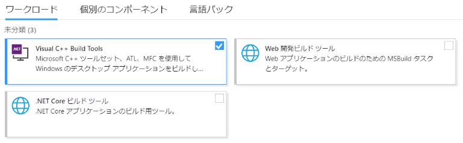

# hello-axum
axumを用いてwebAPIの実装をしていくための備忘録だよ。

# 環境構築
【rust】
```
（きっと後でかくよ...）
```

【cargo】
```
// cargo
cargo new hello-axum
cd hello-axum
cargo build

// curl(もしくはブラウザ)
curl 'http:localhost:3000'
```


## cargo buildで詰まったら
以下のエラーが出る場合にはビルドツールが不足している可能性がある
```
error: linker `link.exe` not found
note: The system cannot find the file specified. (os error 2)
note: the msvc targets depend on the msvc linker but `link.exe` was not found
note: please ensure that VS 2013, VS 2015 or VS 2017 was installed with the Visual C++ option
error: aborting due to previous error
```
【対処方法】
1. Visual Studio Installer経由でVisual C++ Build Toolsをインストールする<br>
これでやったけど解消されなかった。


2. rustツールチェインを使ってインストールする（推奨）<br>
恐らくこちらの方が楽だし、実行後cargo buildが正常に完了したことを確認
```
rustup toolchain install stable-x86_64-pc-windows-gnu
rustup default stable-x86_64-pc-windows-gnu
cargo build
```
