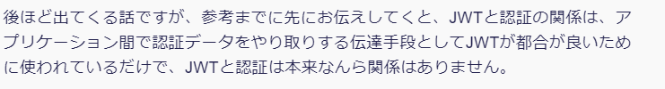

# 認証(Authentication)
※自分の理解と実態との乖離がありそう。（特にアクセストークンと認可周りの話が嘘っぽい気がする。）ので調査して修正せよ。


アカウントログイン、ログイン認証とかメール認証とか
個人の情報をもとにサービスにアクセスすること
その後の認可と絡めて話すと、認証によって個々のユーザー向けのトークン（一般にはJSON Web Token：JWT）を取得する一連の流れ※

※この手法は、[トークンベース認証]と呼ばれるもので、このほかにも<br>
　ログイン情報をセッションで管理する方法もある。（セッションベース認証）

## トークンベース認証
主にこちらを取り扱うことにする。（※というのも、セッションベース認証は大規模サービス向けの仕組みとしては不向きなため、今後マイクロサービスの開発にあたってはトークンベース認証が普通なのかなと判断。）

トークンベース認証では、ユーザーログイン時に自身のID・PASS等の情報と引き換えに一意の[アクセストークン]を受け取る方式。
→パスポート的なもの（自身を証明するもの）

このアクセストークンを用いて、その背後にあるAPIとかリソースサーバーとかにアクセス許可を求めるような動きになる。（※この辺から認可の話になってくる）

## トークン
トークンは、主に以下のような特性を持っている
- ユーザーごとに一意である
  ユーザーの認証情報から一意に生成されるパスワード的な情報
- 有効期限をもつ
  一生同じトークンを使いまわせるとセキュリティ的に（？）いけないので、通常は有効期限を持っている。
  有効期限が切れる前に、もしくは切れた後で別途リフレッシュトークンを発行してもらう。
- 認可に利用される（そのためアクセストークンとも呼ばれる）
  ログインできたからどのサービスにもリソースにもアクセスできる。だと💩サービスなので、トークン検証によってアクセスしようとしているサービスへの許可がされているかを確認する。

### JWT:Json Web Token
ジョットと呼ぶらしい。 （??? <ｳｾﾅｯ!）
どういうものか、どんな構成のトークンかまとめる。

[定義]
RFCが定めるには
```
HTTPヘッダーやクエリパラメータなどスペースに制約がある環境で使うことを前提に、JSON形式のデータをURLセーフでコンパクトな形式にしたもの
```
らしい。
具体的には
- JSONデータをBASE64URLエンコードしておく
- 一般的なデータ項目名などを省略形で定める
といった感じ

予約語として定められているものは以下
|省略名|項目名|説明|
|----|----|----|
|iss|issuer|JWTの発行者|
|sub|subject|ユーザの識別子などJWTの主体|
|aud|audience|JWTの受信者|
|exp|expiration time|JWTの有効期限|
|nbf|Not Before|JWTの有効開始日時|
|iat|Issued At|JWTの発行日時|
|jti|JWT ID|JWTの一意な識別子|

[用語]
- クレーム<br>
  JWTにおけるデータ項目(JSONのkye-valueの項目)を指す
  先述した予約されているクレームのことを登録クレームと呼ぶらしい。
  JWTでは必須となる登録クレームが定められていない。
  なのでJWTを利用するアプリケーションで柔軟に決定できる。
  また登録クレーム以外にも、必要なデータを任意にクレームに追加してあげる事もできる。


[構造とか]
定義の通りでコンパクトなJSONデータをBASE64URLエンコードしたデータ
```
// 元データ
{
  "iss":"example.com.jwt",
  "sub":"sample",
  "exp":1092081,
  "email":"tarou@example.com"
}

// Base64URLエンコードされてJWT
elkuasfkji12j3kjlkdflksje4
aslkdjfi34lkfajsdfaiklk334
falkjklk12lk32lkjafsedeefa
```

[まとめ]

[株式会社豆蔵さんの記事にあるように](https://developer.mamezou-tech.com/blogs/2022/12/08/jwt-auth/)
JWTはあくまでHTTPヘッダーに載せるためのJSONデータの取り扱いを定めた話なだけであって、認証とは関係ない（認証に使うときに都合がいいという話なだけ）

[基本から理解するJWTとJWT認証の仕組み (豆蔵ディベロッパーサイト) より引用]

### JWS: JSON Web Signature
JWTはBase64エンコードというとても簡易的な暗号化（ただエンコードしただけのデータなので暗号化とは言えない。難読化）なので、容易に復号できるし
データをいじって再度エンコードすれば容易に改ざんが可能

なのでこれの対策として、秘密鍵と暗号化アルゴリズムを利用した
JWSという方法がある。

[概要]

[構成とか]
主に以下の構成
- header
  暗号化アルゴリズム:alg（※必須）
  payloadのデータ種別:typ
  が主に記載される
- payload
  JWTのクレームがここに載る
- signature
  headerとpayloadを選択した暗号化方式で暗号化したものをくっつける

[作成手順]
1. ペイロードをbase64urlエンコード
2. ヘッダーをbase64urlエンコード
3. 1,2のデータを"."でつなぐ
4. 3の結果を秘密鍵とalgで指定した方式で暗号化、その結果をbase64urlエンコード
5. 3+.+4の形で完成(JWSコンパクトシリアライゼーションって呼ぶ)

暗号化鍵は（秘密鍵）は信頼した相手にしか共有されてない（ことを前提としている）
カギを利用して、暗号化された部分を復号して、header+payloadとの検証を行う
※よりデータサイズを節約するために、実際には以下のようなハッシュ形式でのやり取りをする
```
encode(encrypt(hash(encode(header)+.+encode(payload)))) -> 4
```

## JWTによる認証


# rustでjwt認証とか
jsonwebtokenクレートを使える
```
use jsonwebtoken::{encode, Header, Algorithm, EncodingKey};
use serde::{Deserialize, Serialize};

#[derive(Debug, Serialize, Deserialize)]
pub struct Claims {
  account_id: String,
  iat: i64,
  exp: i64,
}

```

# 参考資料
- [マイクロサービス向けの認証・認可](https://speakerdeck.com/oracle4engineer/authentication-and-authorization-in-microservices-and-jwt?slide=4)

